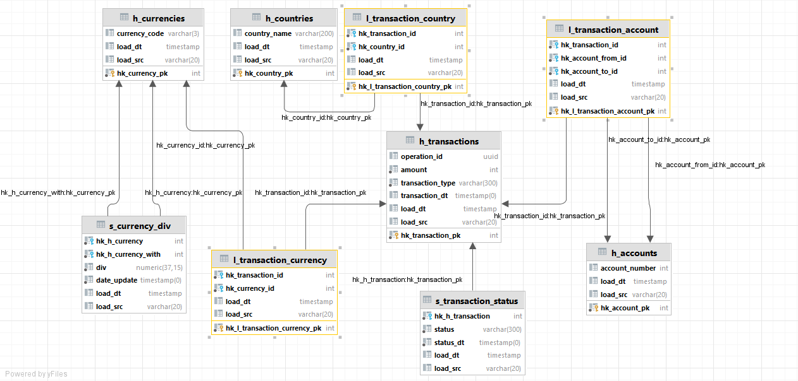

### Задача
Контекст работы компании:
- финтех-стартап, который предлагает международные банковские услуги через приложение: пользователи могут безопасно переводить деньги в разные страны.
- в каждой стране, где доступно приложение, есть отдельный сервис, работающий с валютой этой страны.
-  компания ведёт учёт транзакционной активности клиентов внутри и между странами: разработан единый протокол передачи данных, который обеспечивает одинаковую структуру таблиц во всех странах.

Описание задачи
- Команда аналитиков попросила вас собрать данные по транзакционной активности пользователей и настроить обновление таблицы с курсом валют.
- Цель — понять, как выглядит динамика оборота всей компании и **что приводит к его изменениям(?)**. 

Входные данные
- **transactions**
  - operation_id — id транзакции;
  - account_number_from — внутренний бухгалтерский номер счёта транзакции ОТ КОГО;
  - account_number_to — внутренний бухгалтерский номер счёта транзакции К КОМУ;
  - currency_code — трёхзначный код валюты страны, из которой идёт транзакция;
  - country — страна-источник транзакции;
  - status — статус проведения транзакции: queued («транзакция в очереди на обработку сервисом»), in_progress («транзакция в обработке»), blocked («транзакция заблокирована сервисом»), done («транзакция выполнена успешно»), chargeback («пользователь осуществил возврат по транзакции»).
  - transaction_type — тип транзакции во внутреннем учёте: authorisation («авторизационная транзакция, подтверждающая наличие счёта пользователя»), sbp_incoming («входящий перевод по системе быстрых платежей»), sbp_outgoing («исходящий перевод по системе быстрых платежей»), transfer_incoming («входящий перевод по счёту»), transfer_outgoing («исходящий перевод по счёту»), c2b_partner_incoming («перевод от юридического лица»), c2b_partner_outgoing («перевод юридическому лицу»).
  - amount — целочисленная сумма транзакции в минимальной единице валюты страны (копейка, цент, куруш);
  - transaction_dt — дата и время исполнения транзакции до миллисекунд.

Пример содержимого payload:
```json
{
    "amount": "120000", "status": "done", "country": "russia", 
    "operation_id": "1dececff-21b2-470f-8bb6-abfd3f8f72a3", "currency_code": "430", 
    "transaction_dt": "2022-10-01 11:54:08", 
    "transaction_type": "sbp_incoming", "account_number_to": "903810", "account_number_from": "914810"
}
```

- сurrencies 
  - date_update — дата обновления курса валют;
  - currency_code — трёхзначный код валюты транзакции;
  - currency_code_with — отношение другой валюты к валюте трёхзначного кода;
  - currency_code_div — значение отношения единицы одной валюты к единице валюты транзакции.
  
Пример содержимого payload:
```json
{"date_update": "2022-10-04 00:00:00", "currency_code": "460", "currency_with_div": "1.03", "currency_code_with": "450"}
```

### Логика работы решения:
1. Источником данных будет кластер Kafka развернутый в Yandex Cloud.
2. С помощью Spark Structured Streaming данные считываются и записываются в Postgres,  развернутый в Yandex Cloud.
3. Даг в Airflow с периодичностью в один день забирает данные из Postgres в staging слой на Vertica.
4. Так же с периодичностью в один день обновляются слои DDS и CDM в Vertica

### Модель данных (DV)


### Структура репозитория
Файлы в репозитории будут использоваться для проверки и обратной связи по проекту. Поэтому постарайтесь публиковать ваше решение согласно установленной структуре: так будет проще соотнести задания с решениями.

Внутри `src` расположены папки:
- `/src/dags` - вложите в эту папку код DAG, который поставляет данные из источника в хранилище.
- `/src/sql` - SQL-запросы формирования таблиц в `STAGING`- и `DWH`-слоях, а также скрипт подготовки данных для итоговой витрины.
- `/src/py` - если источником вы выберете Kafka, то в этой папке разместите код запуска генерации и чтения данных в топик.
- `/src/img` - здесь разместите скриншот реализованного над витриной дашборда.
